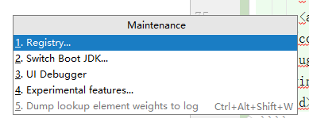

#### 注解映射方法中@GetMapping、@PostMapping、@PutMapping、@DeleteMapping、@PatchMapping的区别：
+ @GetMapping：用于将HTTP GET请求映射到特定处理程序方法的注释。具体来说，@GetMapping是一个作为快捷方式的组合注释。@RequestMapping(method = RequestMethod.GET)。
+ @PostMapping：用于将HTTP POST请求映射到特定处理程序方法的注释。具体来说，@PostMapping是一个作为快捷方式的组合注释@RequestMapping(method = RequestMethod.POST)。
+ @RequestMapping：一般情况下都是用@RequestMapping（method=RequestMethod.），因为@RequestMapping可以直接替代以上两个注解，但是以上两个注解并不能替代@RequestMapping，@RequestMapping相当于以上两个注解的父类！
+ @PutMapping：@PostMapping和@PutMapping作用等同，都是用来向服务器提交信息。如果是添加信息，倾向于用@PostMapping，如果是更新信息，倾向于用@PutMapping。两者差别不是很明显。
+ @DeleteMapping：删除URL映射，具体没有再实践中用过，不知道好在什么地方。
+ @PatchMapping：至今不知如何用，再什么场景下用。。。有知道的欢迎留言或私信。
---
#### @Param()和@PathVariable()注解
+ @param()：用注解来简化xml配置的时候（比如Mybatis的Mapper.xml中的sql参数引入），@Param注解的作用是给参数命名,参数命名后就能根据名字得到参数值,正确的将参数传入sql语句中（一般通过#{}的方式，${}会有sql注入的问题）。
````java
public int getUsersDetail(@Param("userid") int userid);

<select id="getUserDetail" statementType="CALLABLE" resultMap="baseMap">
          Exec WebApi_Get_CustomerList #{userid}
</select>
````
+ @pathvariable():带占位符的 URL 是 Spring3.0 新增的功能，该功能在SpringMVC 向 REST 目标挺进发展过程中具有里程碑的意义。通过 @PathVariable 可以将 URL 中占位符参数绑定到控制器处理方法的入参中：URL 中的 {xxx} 占位符可以通过@PathVariable(“xxx“) 绑定到操作方法的入参中。主要是根据请求方法进行类的区别。
---
#### #{}与${}的区别
PreparedStatement不允许在插入参数时改变SQL语句的逻辑结构。
经常碰到这样的面试题目：#{}和${}的区别是什么？
 
网上的答案是：#{}是预编译处理，$ {}是字符串替换。mybatis在处理#{}时，会将sql中的#{}替换为?号，调用PreparedStatement的set方法来赋值；mybatis在处理 $ { } 时，就是把 ${ } 替换成变量的值。使用 #{} 可以有效的防止SQL注入，提高系统安全性。
 
对于这个题目我感觉要抓住两点：
（1）$ 符号一般用来当作占位符，常使用Linux脚本的人应该对此有更深的体会吧。既然是占位符，当然就是被用来替换的。知道了这点就能很容易区分$和#，从而不容易记错了。
（2）预编译的机制。预编译是提前对SQL语句进行预编译，而其后注入的参数将不会再进行SQL编译。我们知道，SQL注入是发生在编译的过程中，因为恶意注入了某些特殊字符，最后被编译成了恶意的执行操作。而预编译机制则可以很好的防止SQL注入。
 
最后想说的是，对于mybatis 以及 sql 而言，每一个考点背后都是有一个深刻的思想存在的，应该好好的体会。这样才能真正的做到技术提升，成为技术大牛。

---
#### `classpath:`和`classpath*:`的区别
+ src路径下的文件在编译后会放在WEB-INF/classes路径下，默认的classpath指这里。若直接放在WEB-INF下，ClassPathXmlApplicationContext获取不到
+ maven项目的resources目录就是默认的classpath
+ classpath即为java文件编译后class文件的编译目录，一般为WEB-INF\classes，src下的xml在编译时也会复制到classpath下
````java
ApplicationContext ctx = new ClassPathXmlApplicationContext("xxx.xml");
ApplicationContext ctx = new FileSystemXmlApplicationContext("WebRoot/WEB-INF/xxx.xml");
````
+ web.xml中classpath和classpath*的区别：
    1. classpath只会到`WEB-INF/classpath`路径下找文件
    2. classpath*不仅会在`WEB-INF/classpath`路径下找文件，还会到jar文件中（class路径）进行查找

+ classes含义：
   1. 存放各种资源配置文件（init.properties;log4j.properties)
   2. 存放模板文件（actionerror.ftl）
   3. 存放class文件，对应开发项目的src目录编译文件
   
---
#### 热部署
1. 添加依赖
````java
<!--热部署-->
<dependency>
    <groupId>org.springframework.boot</groupId>
    <artifactId>spring-boot-devtool</artifactId>
    <scope>runtime</scope>
    <optional>true</optional>
</dependency>
````

2. 添加插件
````java
<build>
<!--工程的名字-->
<finalName>cloud2020</finalName>
<plugins>
  <plugin>
    <groupId>org.springframework.boot</groupId>
    <artifactId>spring-boot-maven-plugin</artifactId>
    <version>2.2.2.RELEASE</version>
    <configuration>
      <fork>true</fork>
      <addResources>true</addResources>
    </configuration>
  </plugin>
</plugins>
</build>
````

3. 开启
快捷键`ctrl`+`alt`+`shift`+`/`




4. 重启IDEA

---
#### RestTemplate
提供了多种便捷访问远程Http服务的方法
是最简单的访问restful服务模板类，是Spring提供的用于访问Rest服务的客户端模板工具集
是对HttpClient的封装

---
#### jdbcTemplate
